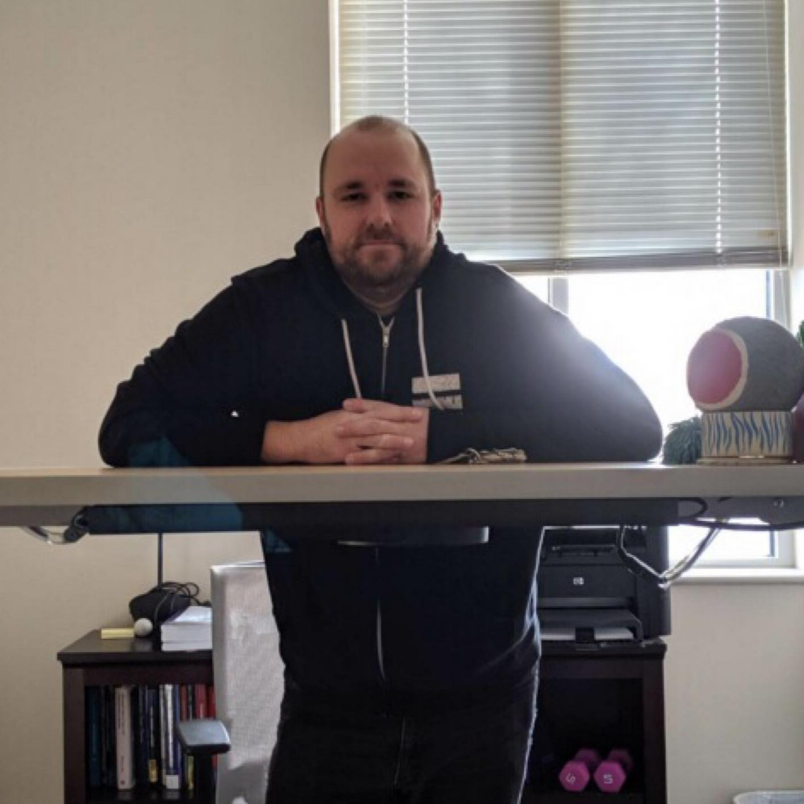

Welcome!
===

I am an Associate Professor in the <a href="https://www.augusta.edu/ccs/">School of Computer and Cyber
Sciences</a> at <a href="http://www.augusta.edu" target="_blank">Augusta
  University</a>.
  
<a href="http://spots.augusta.edu/caubert/">Clément Aubert</a> and I run the <a href="https://the-au-forml-lab.github.io/">ForML Lab</a>.
  
On this page you will find my research interests, contact
information, and <a href="includes/cv.pdf">CV</a> (Updated
May 2022).

#### Current Projects

My current project is
on <a href="https://granule-project.github.io/">The Granule
Project</a> where I am studying graded logics, models, and type theories.

#### Research interests

- Keywords: Programming languages, type theory, category theory, and logic in computer science.
- [AMS Classes](/AMS-classes.html)

#### Conference and workshop service

  <a href="https://icfp19.sigplan.org/series/icfp" class="list-group-item">Program committee member for ICFP 2021</a>
  <a href="http://gramsec.uni.lu/" class="list-group-item">coChair for GraMSec 2020</a>
  <a href="https://lipn.univ-paris13.fr/LinearityTLLA2020/" class="list-group-item">Program committee member for LINEARITY && TLLA 2020</a>
  <a href="https://the-au-forml-lab.github.io/SERPL2019" class="list-group-item">coChair for SERPL 2019</a>
  <a href="http://gramsec.uni.lu/https://gramsec.uni.lu/2019/organization.php" class="list-group-item">Program committee member for GraMSec 2019</a>
  <a href="http://gramsec.uni.lu/https://gramsec.uni.lu/2018/organization.php" class="list-group-item">Program committee member for GraMSec 2018</a>
  <a href="http://gramsec.uni.lu/2017/organization.php" class="list-group-item">Program committee member for GraMSec 2017</a>
  <a href="http://plpv.tcs.ifi.lmu.de" class="list-group-item">Program committee member for PLPV 2013</a>

<h4>Contact Information</h4>

  <a class="list-group-item">Office: University Hall</a>
  <a href="mailto:harley.eades@gmail.com" class="list-group-item">Email: harley.eades@gmail.com</a>

  

